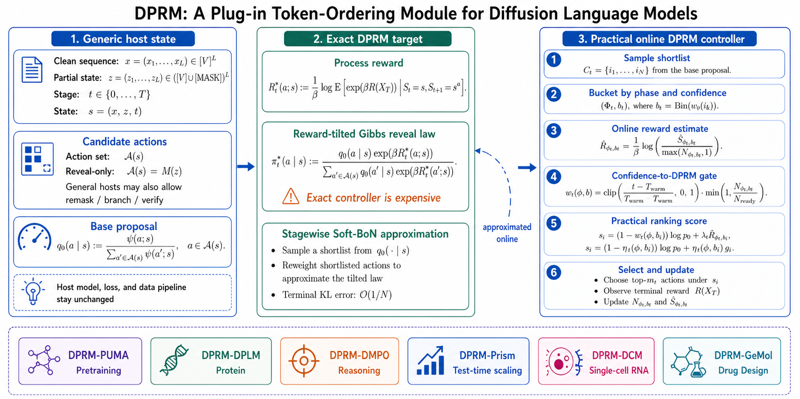

# DPRM-DLLM

Official implementation of **ICML 2026 Fogen Oral**  paper [*DPRM: A Plug-in Token-Ordering Module for Diffusion Language Models*](https://arxiv.org/pdf/2604.24357).

**DPRM-DLLM** is a plug-in token-ordering module for masked discrete diffusion and diffusion language models.

It does **not** replace your model, denoising objective, reward model, verifier, tokenizer, data loader, or search scaffold. It replaces only the policy that decides **which masked tokens, residue positions, or search candidates should be acted on next**.



The default controller follows a practical three-stage schedule:

1. use the host algorithm's original ordering early, usually random or confidence top-k;
2. preserve train-test alignment when the host already uses progressive teacher-forced masked states;
3. smoothly transition to an online Doob-style process-reward correction with bucketized statistics and optional Soft Best-of-N shortlisting.

This repository is designed for two integration styles:

- **Manual integration:** import `src/dprm` and call the controller from your training or decoding loop.
- **Assistant-guided integration:** point Codex or Claude at your host repository and use the prompts in [`prompts/`](./prompts) plus the host patch maps in [`integrations/`](./integrations).

## Installation

```bash
git clone https://github.com/DakeBU/DPRM-DLLM.git
cd DPRM-DLLM
pip install -e .
```

The reusable package depends only on PyTorch:

```python
from dprm import DPRMConfig, HostDPRMBatch, OnlineDPRMController
```

## When DPRM Is A Valid Plug-in

DPRM is appropriate when the host exposes an ordering decision that can be changed independently from the denoiser.

Your host should provide:

- `confidence`: per-position proposal confidence or probability;
- `candidate_mask`: which positions are eligible for reveal, remask, branch, or verification;
- `phase_ids`: progressive phase, decode-step bucket, or search-stage bucket;
- `aux_bin_ids`: optional task-specific bucket such as structure bin or verifier bucket;
- `rewards`: terminal or intermediate utility already computed by the host.

DPRM is **not** a drop-in replacement for diffusion samplers that update the full sequence in parallel and never choose a subset of positions. In that case one must first design a sequential or blockwise sampler, which is a different algorithmic change.

## Minimal Manual Usage

```python
import torch
from dprm import DPRMConfig, HostDPRMBatch, OnlineDPRMController

controller = OnlineDPRMController(
    DPRMConfig(
        num_phases=8,
        confidence_bins=16,
        reward_temperature=1.0,
        guidance_scale=1.0,
        warmup_steps=2_000,
        switch_steps=20_000,
        ready_count=128,
        sampled_soft_bon=True,
    ),
    device=torch.device("cuda"),
)

# Host tensors for one ordering decision.
confidence = torch.rand(4, 128, device="cuda")
candidate_mask = torch.ones(4, 128, dtype=torch.bool, device="cuda")
phase_ids = torch.tensor([0, 0, 1, 1], device="cuda")
num_select = torch.tensor([8, 8, 8, 8], device="cuda")

host = HostDPRMBatch(
    confidence=confidence,
    candidate_mask=candidate_mask,
    phase_ids=phase_ids,
    global_step=5_000,
)
selection = controller.select(host, num_select)

# Apply the selected positions in your own host code.
selected_mask = selection.selected_mask

# Later, update DPRM with a utility the host already computed.
reward_per_sequence = torch.tensor([0.3, 0.7, 0.1, 0.9], device="cuda")
controller.observe(host, selected_mask, reward_per_sequence)
```

See [`examples/minimal_usage.py`](./examples/minimal_usage.py) for a runnable CPU example.

## Integration With Codex Or Claude

The recommended assistant workflow is:

1. clone this repository next to your host codebase;
2. give the assistant your host repository path and a short task description;
3. identify the host's current ordering policy, such as random masking, confidence top-k, low-confidence remasking, or trajectory pruning;
4. ask the assistant to preserve the model, objective, data, verifier, and budget, and only replace the ordering controller;
5. require the assistant to keep the original ordering behind a baseline flag.

Use these prompt templates:

- [`prompts/CODEX_INTEGRATION_PROMPT.md`](./prompts/CODEX_INTEGRATION_PROMPT.md)
- [`prompts/CLAUDE_INTEGRATION_PROMPT.md`](./prompts/CLAUDE_INTEGRATION_PROMPT.md)

Shortest useful prompt:

> Integrate DPRM into `<HOST_REPO_PATH>`. This is a `<progressive pretraining / post-training / protein diffusion / test-time scaling / multimodal text-token generation / visual-token generation>` setup. Keep the model, objective, data pipeline, verifier, and compute budget unchanged. Only replace the token-ordering policy. Use `<reward / verifier score / reconstruction utility / amino-acid recovery / VQA correctness / image-text score>` as the DPRM utility. Preserve the original ordering as a baseline flag.

Ask the assistant to return:

- exact files touched;
- new config flags;
- baseline command;
- DPRM command;
- one README note explaining the hook points;
- per-example logging for paired bootstrap whenever possible.

## Host Settings Demonstrated In The Paper

| Variant | Host | Stage | Domain | Reference | Upstream code |
|---|---|---|---|---|---|
| DPRM-PUMA | PUMA | Pretraining | Language reasoning | [PUMA paper](https://arxiv.org/abs/2602.10314) | [JaeyeonKim01/PUMA](https://github.com/JaeyeonKim01/PUMA) |
| DPRM-DPLM | DPLM-2 Bit | Generative modeling | Protein inverse folding | [DPLM-2 paper](https://arxiv.org/abs/2504.11454), [design-space protocol](https://bytedance.github.io/dplm/dplm-2.1/) | [bytedance/dplm](https://github.com/bytedance/dplm) |
| DPRM-DMPO | DMPO | Post-training | Reasoning | [DMPO paper](https://arxiv.org/abs/2510.08233) | [yuchen-zhu-zyc/DMPO](https://github.com/yuchen-zhu-zyc/DMPO) |
| DPRM-Prism | Prism | Test-time scaling | Reasoning | [Prism paper](https://arxiv.org/abs/2602.01842) | [viiika/Prism](https://github.com/viiika/Prism) |
| DPRM-DCM | DCM | Generative modeling | Single-cell gene expression | [DCM paper](https://www.biorxiv.org/content/10.64898/2026.02.19.705033v1.full.pdf) | [sanjukta7/aivc-dcm](https://github.com/sanjukta7/aivc-dcm) |
| DPRM-GenMol | GenMol V2 | Generative modeling | Molecular / drug design | [GenMol paper](https://arxiv.org/abs/2501.06158) | [NVIDIA-Digital-Bio/genmol](https://github.com/NVIDIA-Digital-Bio/genmol) |
| DPRM-SDPO | SDPO | Post-training | DNA sequence design | [SDPO paper](https://arxiv.org/pdf/2507.04832) | [hanjq17/discrete-diffusion-sdpo](https://github.com/hanjq17/discrete-diffusion-sdpo) |
| DPRM-Omni | Omni-Diffusion | Generative modeling | Text-to-image visual-token generation | [Omni-Diffusion code](https://github.com/VITA-MLLM/Omni-Diffusion) | [VITA-MLLM/Omni-Diffusion](https://github.com/VITA-MLLM/Omni-Diffusion) |
| DPRM-LLaDA-V | LLaDA-V | Decoding / evaluation | Image-conditioned text generation | [LLaDA-V model](https://huggingface.co/GSAI-ML/LLaDA-V) | [GSAI-ML/LLaDA-V](https://huggingface.co/GSAI-ML/LLaDA-V) |

The folders in [`integrations/`](./integrations) are lightweight patch maps and overlay snippets. They are not full third-party repositories and do not include checkpoints, datasets, or generated evaluation outputs.

## Result Summaries

All comparisons keep the host model and task protocol fixed as much as possible, and change only token ordering.

| Host setting | Main comparison | Result |
|---|---|---|
| DPRM-PUMA on GSM8K validation | PUMA confidence order vs DPRM-PUMA at the latest shared checkpoint | Mean score improves from `29.34` to `34.27`, a `+16.8%` relative gain. |
| DPRM-DMPO on MATH Hard | Progressive DMPO vs DMPO-DPRM | Average pass@K improves from `44.3` to `47.9`, a `+8.1%` relative gain. |
| DPRM-DMPO on Countdown Hard | Progressive DMPO vs DMPO-DPRM | Average pass@K improves from `29.6` to `33.4`, a `+12.8%` relative gain. |
| DPRM-Prism on GSM8K | Prism confidence HTS vs DPRM-Prism under the same search scaffold | Voted accuracy improves from `82.41` to `83.85`, a `+1.44` point gain. |
| DPRM-DPLM forward folding | DPLM-2 Bit vs ordering-aware variants | FF RMSD decreases from `35.47` to `29.43`, a `17.0%` reduction; FF TM increases from `0.3071` to `0.3321`, a `+8.1%` relative gain. |
| DPRM-DPLM co-generation | DPLM-2 Bit vs ordering-aware variants | Co-generation is mixed: confidence-progressive is strongest on macro TM-score and pLDDT in the retained three-seed summary, while DPRM variants are not uniform wins. |
| DPRM-DCM on Dentate Gyrus | DCM-random vs ordering-aware DCM variants | In the matched four-way evaluation, token recovery improves from `66.76%` to `76.07%` for Progressive-DCM, while DPRM(conf.) reaches `76.00%`; MAE decreases from `0.758` to `0.628` for Progressive-DCM and `0.642` for DPRM(conf.); zero-expression accuracy improves from `82.83%` to `99.86%` for DPRM(random)-DCM. |
| DPRM-GenMol V2 molecular generation | GenMol V2 vs ordering-aware GenMol V2 variants | The clean robust eval is mixed: DPRM(random)-GenMol has the highest de novo quality (`0.825`) with near-perfect validity (`0.999`), while baseline GenMol has the highest uniqueness (`0.942`) and Progressive-GenMol has the highest diversity (`0.859`). Fragment-conditioned metrics are not uniformly improved in the robust pass, so this is portability evidence rather than a uniform molecular-design win. |
| DPRM-SDPO on Gosai DNA design | SDPO-DNA vs ordering-aware SDPO-DNA variants | DPRM(random)-SDPO improves the total metric from `1.155` to `2.192`, ATAC accuracy from `0.356` to `0.785`, and k-mer Pearson from `0.833` to `0.846`; DPRM(conf.)-SDPO achieves the highest HepG2 (`4.61`). |
| DPRM-Omni-Diffusion text-to-image | Visual-token confidence-progressive vs DPRM-confidence | On the 64-prompt official-step split, CLIP-L/14 mean cosine is `0.24915` for DPRM-confidence and `0.24744` for confidence-progressive; DPRM-random is negative (`0.21456`). |
| DPRM-LLaDA-V image-conditioned VQA | Text-token four-order comparison | AI2D improves from confidence-progressive `0.658` to DPRM-confidence `0.692`; RealWorldQA is a boundary case where confidence-progressive remains strongest (`0.46013`). |

## Mechanism And Boundary Diagnostics

The repository also includes compact diagnostics for two common questions:
whether DPRM is only increasing uncertainty, and whether bucketized statistics
capture useful low-dimensional order structure.

| Diagnostic | Result | Interpretation |
|---|---|---|
| SDPO-DNA entropy and bucket controls | Three-seed total metric: DPRM-random `2.1287`, entropy-only `1.1411`, shuffled bucket `1.8660`, gate/count-only `2.0699`. | Reward-blind entropy is not enough; bucket values help, but readiness/count structure also contributes. |
| LLaDA-V EOT and uncertainty controls | AI2D: DPRM-confidence `0.690`, SACM `0.678`, progressive `0.658`, entropy `0.634`. RealWorldQA: EOT suppression `0.498`, progressive `0.460`, entropy `0.446`, DPRM-confidence `0.418`. | DPRM can capture useful text-order structure on short structured answers; broad VQA needs task-format or EOT-aware auxiliary bins. |
| DMPO Countdown retained control checkpoint | DPRM is much stronger than entropy-only at pass@16/32, but confidence-progressive remains best on that retained checkpoint and shuffled/gate/count ablations are close. | This rejects a pure entropy-only explanation but should not be used as a clean bucket-value isolation result. |
| Prism cost-quality control | Representative GSM8K rows: confidence rank1 `0.828` at mean NFE `610.56`; DPRM warmup-0.2 rank1 `0.860` at mean NFE `1061.06`; confidence `N=32` rank1 `0.844` at mean NFE `745.21`. | DPRM improves quality in this setting while increasing compute; compare cost-quality, not accuracy alone. |

Compact public CSVs:

- [`statistics_outputs/multimodal_order_results.csv`](./statistics_outputs/multimodal_order_results.csv)
- [`statistics_outputs/mechanism_controls.csv`](./statistics_outputs/mechanism_controls.csv)

Method definitions for these controls are in [`docs/MECHANISM_CONTROLS.md`](./docs/MECHANISM_CONTROLS.md).


## Repository Layout

```text
DPRM-DLLM/
├── src/dprm/                 # reusable DPRM package
│   ├── controller.py         # host-agnostic online controller
│   ├── contracts.py          # minimal host-to-DPRM interface
│   ├── tables.py             # offline table scoring and trace utilities
│   └── adapters/             # pattern-specific adapters
├── prompts/                  # Codex and Claude integration prompts
├── integrations/             # host-specific patch maps and overlays
│   ├── puma/
│   ├── dplm/
│   ├── dmpo/
│   ├── prism/
│   ├── dcm/
│   ├── genmol/
│   ├── sdpo/
│   ├── omni_diffusion/
│   └── llada_v/
├── statistics_outputs/       # result summaries and uncertainty plots
├── examples/                 # small runnable examples
├── docs/                     # attribution and release notes
├── DPRM1.png                 # overview figure
├── pyproject.toml
└── LICENSE
```

## What The Controller Computes

For each eligible position \(i\), DPRM starts from the host proposal score, usually \(\log p_i\). It maintains a bucketized process-reward estimate indexed by phase and confidence bin:

```text
R_hat(phase, bin) = (1 / beta) log E[exp(beta * reward) | phase, bin].
```

The action score is:

```text
score_i = log p_i + gate_i * guidance_scale * R_hat(phase_i, bin_i).
```

The gate is the product of:

- a global schedule from `warmup_steps` to `switch_steps`;
- a local readiness factor based on bucket count and `ready_count`.

This makes early behavior match the host's original ordering, and only turns on DPRM guidance when the online estimator has enough support. For trace-first integrations such as LLaDA-V and Omni-Diffusion, [`src/dprm/tables.py`](./src/dprm/tables.py) provides the matching offline-table path: log selected buckets, join them with terminal rewards, build a JSON table with [`examples/build_bucket_table_from_traces.py`](./examples/build_bucket_table_from_traces.py), and load it at inference time.

## Integration Notes By Host Type

### Progressive pretraining, e.g. PUMA

Replace the reveal-set scorer inside teacher-forced progressive unmasking. Keep the denoising target and progressive state construction fixed. Use the same controller during validation decoding if the host uses an aligned decode order.

Patch map: [`integrations/puma`](./integrations/puma)

### Post-training, e.g. DMPO

Keep the reward-tilted target distribution, weighted denoising loss, replay reuse, and optimizer fixed. Replace only the masked-state sampler and aligned decode-time remasking policy.

Patch map: [`integrations/dmpo`](./integrations/dmpo)

### Protein diffusion, e.g. DPLM-2 Bit

Keep the host protein denoiser fixed. For DPLM-2 Bit this means preserving the architecture, structure tokenizer, multimodal conditioning, and denoising losses. Use amino-acid recovery or another self-supervised terminal utility as DPRM reward. Optional protein-specific buckets can be added only if they are already cheap in the host.

Patch map: [`integrations/dplm`](./integrations/dplm)

### Test-time scaling, e.g. Prism

Keep search width, local branching, pruning cadence, self-verification, and NFE accounting fixed. Replace only the confidence ranking used to select or remask tokens inside the search loop.

Patch map: [`integrations/prism`](./integrations/prism)

### Scientific count-token diffusion, e.g. DCM

Keep the single-cell count-bin preprocessing, DCM/SEDD denoising objective, train/validation split, and optimizer fixed. Replace only the masked gene-position reveal order. Use self-supervised reconstruction utility, such as selected-bin token recovery, unless the host already exposes a downstream biological utility.

Patch map: [`integrations/dcm`](./integrations/dcm)

### Molecular SAFE diffusion, e.g. GenMol V2

Keep GenMol V2's SAFE / bracket-SAFE representation, denoising model, molecular sampling tasks, and RDKit-based evaluation fixed. Replace only the mask-reveal order used in de novo and fragment-conditioned decoding. The current training integration uses a self-supervised reconstruction-confidence utility; molecular validity, QED/SA quality, fragment retention, or task-specific oracle scores are natural alternatives for property-targeted training or test-time constrained generation.

Patch map: [`integrations/genmol`](./integrations/genmol)

### Reward-guided discrete diffusion, e.g. SDPO

Keep the discrete diffusion architecture (CNN backbone), substitution parameterization, noise schedule, and SDPO reward-weighted training objective fixed. Replace only the token reveal order during the DDPM sampling loop. Use the Enformer-based oracle expression prediction (or another downstream biological utility) as the DPRM reward.

Patch map: [`integrations/sdpo`](./integrations/sdpo)

### Multimodal visual-token diffusion, e.g. Omni-Diffusion

Keep the multimodal denoiser, image tokenizer, prompt protocol, and image-scoring metric fixed. Replace only the visual-token reveal order. Use a compact image-level utility such as CLIP image-text cosine to build the DPRM table.

Patch map: [`integrations/omni_diffusion`](./integrations/omni_diffusion)

### Multimodal text-token diffusion, e.g. LLaDA-V

Keep the image encoder, projector, language denoiser, tokenizer, and VQA evaluation fixed. Replace only the masked answer-token reveal order. Log EOT and answer-position diagnostics when evaluating broad VQA tasks.

Patch map: [`integrations/llada_v`](./integrations/llada_v)

## Open-Source Boundary

This release is intentionally lightweight. It contains:

- reusable DPRM module code;
- prompt templates;
- patch maps and overlay snippets;
- result summaries and figures.

It does **not** contain:

- model checkpoints;
- downloaded datasets;
- W&B run directories;
- full generated evaluation outputs;
- full third-party host repositories.

To reproduce a host experiment, clone the relevant upstream host repository listed above, then apply the corresponding overlay or ask a coding assistant to adapt the patch map.

## Citation

If this repository is useful, cite the DPRM-DLLM paper draft and the relevant host paper used in your experiment. A `CITATION.cff` template is provided and should be updated with final metadata before public release.

```bibtex
@article{bu2026dprm,
  title={DPRM: A Plug-in Doob h transform-induced Token-Ordering Module for Diffusion Language Models},
  author={Bu, Dake and Huang, Wei and Han, Andi and Wong, Hau-San and Zhang, Qingfu and Suzuki, Taiji and Nitanda, Atsushi},
  journal={arXiv preprint arXiv:2604.24357},
  year={2026}
}
```
