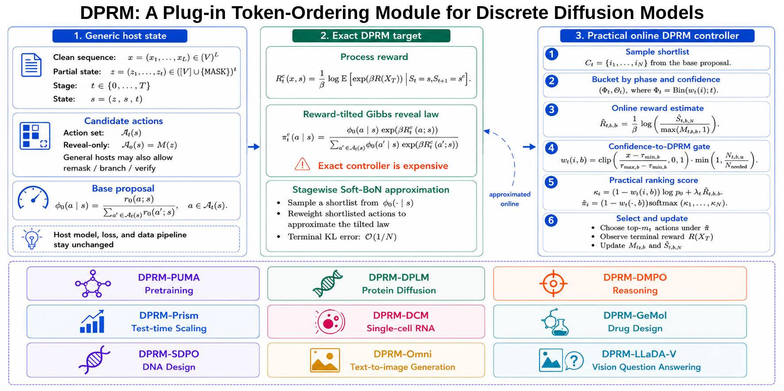

# DPRM: A Plug-in Token-Ordering Module for Discrete Diffusion Models

<p align="center">
  Dake Bu<sup>1,2</sup>, Wei Huang<sup>3,4</sup>, Andi Han<sup>5</sup>, Si Wu<sup>6</sup>,<br>
  Hau-San Wong<sup>1,*</sup>, Qingfu Zhang<sup>1</sup>, Taiji Suzuki<sup>3,7</sup>, Atsushi Nitanda<sup>2,8,*</sup>
</p>
<p align="center">ICML 2026 FoGen (<strong>Oral</strong>)</p>

<p align="center">
  <a href="https://dakebu.github.io/DPRM-DLLM/"></a>
  <a href="https://arxiv.org/abs/2604.24357"></a>
  <a href="https://github.com/DakeBU/DPRM-DLLM"></a>
  <a href="https://huggingface.co/DarkerBu/DPRM-DLLM"></a>
</p>

<p align="center"><sub><sup>1</sup>City University of Hong Kong · <sup>2</sup>CFAR and IHPC, A*STAR · <sup>3</sup>RIKEN AIP · <sup>4</sup>The Institute of Statistical Mathematics<br><sup>5</sup>University of Sydney · <sup>6</sup>South China University of Technology · <sup>7</sup>The University of Tokyo · <sup>8</sup>Nanyang Technological University · <sup>*</sup>Corresponding authors</sub></p>
<p align="center">
  <a href="LICENSE"></a>
  
  
  
</p>

Official implementation of a plug-in ordering controller for masked discrete
diffusion models. DPRM keeps the host architecture, token-value rule, training
labels, and task objective fixed. It changes which eligible token positions are
committed next.

Confidence-based decoding is the strongest common ordering heuristic, but it
optimizes local certainty rather than terminal quality and can therefore be
myopic. DPRM instead tilts the host trajectory distribution by terminal reward
and uses the resulting Doob process reward to order candidate positions. A
compact table shares this correction across states while retaining confidence
as the base order and fallback.



## Results At A Glance

Each row uses the matched host reference and keeps the architecture, objective,
token-value sampler, and evaluation protocol fixed. Percentage-point gains are
used for accuracy and pass@K; relative gains are used for continuous utilities.
For scientific hosts, the table reports the best declared DPRM preference and
labels it simply as DPRM.

| Host | Metric | Matched reference | DPRM | Gain |
|---|---|---:|---:|---:|
| Omni-Diffusion | CLIP-L/14 | 0.18661 | **0.21125** | **+13.2%** |
| Omni-Diffusion | CLIP-B/32 check | 0.23836 | **0.24854** | **+4.3%** |
| LLaDA-V | RealWorldQA | 47.35% | **48.92%** | **+1.57 pp** |
| LLaDA-V | Numeric/count | 32.05% | **41.03%** | **+8.97 pp** |
| PUMA | GSM8K accuracy | 30.10% | **34.50%** | **+4.40 pp** |
| DMPO | MATH mean pass@K | 50.43 | **52.53** | **+2.10 pp** |
| DMPO | MATH Hard mean pass@K | 44.27 | **47.92** | **+3.65 pp** |
| DMPO | Countdown mean pass@K | 53.38 | **55.05** | **+1.67 pp** |
| DMPO | Countdown Hard mean pass@K | 29.64 | **33.38** | **+3.74 pp** |
| Prism | Voted / rank-1 / any-of-4 accuracy | 82.41 / 82.11 / 84.61 | **83.85 / 83.70 / 86.58** | **+1.44 / +1.59 / +1.97 pp** |
| DPLM-2 Bit | CoGen balanced utility | 0.7355 | **0.7377** | **+0.3%** |
| DCM | Nonzero recovery | 0.01826 | **0.01978** | **+8.3%** |
| GenMol V2 | QED | 0.6392 | **0.7350** | **+15.0%** |
| SDPO-DNA | Total utility, 3-seed mean | 1.389 | **2.129** | **+53.3%** |

Seven hosts require no additional denoiser calls: DPRM only looks up a value and
reranks positions already scored by the host. Prism raises mean NFE from `609`
to `1071` because its verifier reward first becomes available during test-time
search; there is no training trajectory stream from which to preload values.
Omni evaluates five continuations from the current canvas because a table fitted
on earlier prompts failed to transfer across unrelated images. These two rows
are explicit quality--compute results. Entropy-only and random-order controls
also underperform DPRM, showing that uncertainty alone is not the source of the
gain. Intervals, preference endpoints, and all retained per-example records are
on the [project page](https://dakebu.github.io/DPRM-DLLM/) and in the paper
supplement.

## Method

For a partial state `s`, the host supplies a proposal `q0(i | s)` over candidate
positions and DPRM targets the Doob-transformed token-order law

```text
pi*(i | s) proportional to q0(i | s) exp(beta R*(i; s)),
R*(i; s) = beta^-1 log E[exp(beta R(X_T)) | s, i].
```

The repository implements two estimators of the conditional future utility:

- **Online bucket DPRM** maps each candidate to a generation `phase_id`, a
  `confidence_bin`, and an optional low-dimensional auxiliary bin. Counts and
  exponentiated terminal rewards provide a log-moment value for each cell.
  Readiness gates reduce unsupported cells to the host confidence order.
- **Prompt-local visual DPRM** evaluates five predeclared positions from one
  shared Omni-Diffusion canvas: the native confidence position and four
  confidence-rank strata. CLIP-L/14 supplies the terminal position value;
  CLIP-B/32 is held out as an independent semantic check. The selected path
  differs from the host path at one token-order decision, while the checkpoint,
  provisional token values, seed, tokenizer, and continuation rule are fixed.

`src/dprm/` contains the host-independent controller, multi-objective reward
scalarization, visual-order helpers, and host adapters. `integrations/` contains
the exact overlay files and commands used for the nine host settings.

For normalized maximization benefits `y_j` and a declared preference vector
`lambda`, the scientific integrations support the weighted utility
`sum_j lambda_j y_j` and an augmented smooth-Tchebycheff utility

```text
1 - mu * logsumexp(lambda_j * (1 - y_j) / mu)
    + rho * sum_j lambda_j y_j.
```

The latter is the maximization counterpart of [Smooth Tchebycheff
Scalarization](https://proceedings.mlr.press/v235/lin24y.html). The paper
configuration uses `mu=0.05` and `rho=0.05`. Preference vectors are declared in
[`reproducibility/scientific_preference_sweeps.json`](reproducibility/scientific_preference_sweeps.json)
before evaluation.

## Install

```bash
git clone https://github.com/DakeBU/DPRM-DLLM.git
cd DPRM-DLLM
python -m venv .venv
source .venv/bin/activate
pip install -e .
```

Host experiments additionally require the corresponding upstream repository,
model checkpoint, data, and evaluator. Each integration README identifies the
upstream revision surface and the files that must be overlaid.

## Minimal Use

```python
import torch
from dprm import DPRMConfig, HostDPRMBatch, OnlineDPRMController

controller = OnlineDPRMController(
    DPRMConfig(num_phases=8, confidence_bins=16, ready_count=64)
)
host = HostDPRMBatch(
    confidence=torch.tensor([[0.25, 0.80, 0.55]]),
    candidate_mask=torch.tensor([[True, True, True]]),
    phase_ids=torch.tensor([2]),
    global_step=100,
)
selection = controller.select(host, num_select=torch.tensor([1]))
```

The host remains responsible for predicting token values. DPRM returns only
the selected position mask and ordering diagnostics.

## Experiments

| Host | Domain | Ordered object | DPRM integration | Upstream |
|---|---|---|---|---|
| Omni-Diffusion | text-to-image | visual codebook position | [`integrations/omni_diffusion`](integrations/omni_diffusion) | [VITA-MLLM/Omni-Diffusion](https://github.com/VITA-MLLM/Omni-Diffusion) |
| LLaDA-V | image-conditioned VQA | answer-token position | [`integrations/llada_v`](integrations/llada_v) | [ML-GSAI/LLaDA-V](https://github.com/ML-GSAI/LLaDA-V) |
| PUMA | language pretraining | response-token position | [`integrations/puma`](integrations/puma) | [JaeyeonKim01/PUMA](https://github.com/JaeyeonKim01/PUMA) |
| DMPO | reasoning post-training | response-token position | [`integrations/dmpo`](integrations/dmpo) | [yuchen-zhu-zyc/DMPO](https://github.com/yuchen-zhu-zyc/DMPO) |
| Prism | test-time scaling | reveal/remask position | [`integrations/prism`](integrations/prism) | [viiika/Prism](https://github.com/viiika/Prism) |
| DPLM-2 Bit | protein diffusion | residue position | [`integrations/dplm`](integrations/dplm) | [bytedance/dplm](https://github.com/bytedance/dplm) |
| DCM | single-cell diffusion | gene-expression bin position | [`integrations/dcm`](integrations/dcm) | [sanjukta7/aivc-dcm](https://github.com/sanjukta7/aivc-dcm) |
| GenMol V2 | molecular diffusion | SAFE-token position | [`integrations/genmol`](integrations/genmol) | [NVIDIA-Digital-Bio/genmol](https://github.com/NVIDIA-Digital-Bio/genmol) |
| SDPO | DNA reward optimization | DNA-token position | [`integrations/sdpo`](integrations/sdpo) | [hanjq17/discrete-diffusion-sdpo](https://github.com/hanjq17/discrete-diffusion-sdpo) |

<details>
<summary><strong>Reproduction registry and release audit</strong></summary>

[`reproducibility/experiments.json`](reproducibility/experiments.json) records
the upstream revisions and executable order settings. Canonical numerical rows
are in [`results/paper_results.csv`](results/paper_results.csv), with protocol
notes in [`results/README.md`](results/README.md).

Evaluators retain one record per prompt, question, target, cell, molecule, or
sequence. When an upstream evaluator does not compute uncertainty,
`scripts/paired_bootstrap.py` joins two CSV/JSON/JSONL files by shared unit id
and writes the paired mean difference, 95% percentile interval, and
win/tie/loss counts. Nested JSON fields use dot notation.
For DMPO success matrices, `scripts/bootstrap_passk.py` recomputes the paired
interval of the reported mean pass@K statistic.

```bash
python scripts/paired_bootstrap.py \
  --baseline confidence.jsonl --method dprm.jsonl \
  --key example_id --value correct --scale 100 \
  --output paired_accuracy.json
```

Run the release audit before launching a host experiment:

```bash
python scripts/verify_release.py
python scripts/reproduce.py --list
python scripts/reproduce.py --host llada_v --variant dprm_confidence --dry-run
```

The command registry checks implementation coverage. The separate artifact
manifest records the retained model/controller states and selected raw records
needed to audit the paper, including byte counts and SHA-256 digests:

```bash
python scripts/verify_artifact_manifest.py
python scripts/verify_artifact_manifest.py \
  --artifact-root "$DPRM_ARTIFACT_ROOT" --require-complete
python scripts/audit_artifact_semantics.py \
  --artifact-root "$DPRM_ARTIFACT_ROOT"
```

See [`reproducibility/release_artifacts.json`](reproducibility/release_artifacts.json).
An entry remains pending until the corresponding reported state is available;
the registry does not treat a runnable command as a substitute for that state.
The semantic audit opens the retained states and checks their phase, bucket,
gate, shortlist, frozen-model, and scientific-preference settings.
The complete code and artifact publication sequence is in
[`docs/RELEASE.md`](docs/RELEASE.md).

Use `--execute` only after setting the host-specific root and checkpoint
environment variables shown by the dry run. Execution is refused unless the
host checkout matches the 40-character commit recorded in the registry. Every
run writes `<HOST_ROOT>/dprm_run_manifests/<host>_<variant>.json` with the exact
command, upstream revision, registry hash, integration-code hash, UTC times,
and exit status. Use `--manifest-out` to place this record beside a particular
experiment output.

</details>

## Result Files

The scientific-domain package reports declared preference vectors, native-scale
objective axes, bootstrap response intervals, and Pareto comparisons. DCM
separates expressed-gene fidelity from zero preservation; GenMol separates QED
and synthetic accessibility from set-level validity, uniqueness, and diversity.

## Repository Layout

```text
src/dprm/             host-independent DPRM implementation
integrations/         upstream overlays and experiment commands
reproducibility/      four-order registry for all nine hosts
results/              canonical paper tables and compact audit artifacts
tests/                controller and integration unit tests
scripts/              release verification and command launcher
```

## Citation

```bibtex
@article{bu2026dprm,
  title   = {DPRM: A Plug-in Token-Ordering Module for Discrete Diffusion Models},
  author  = {Bu, Dake and Huang, Wei and Han, Andi and Wu, Si and Wong, Hau-San and Zhang, Qingfu and Suzuki, Taiji and Nitanda, Atsushi},
  journal = {arXiv preprint arXiv:2604.24357},
  year    = {2026}
}
```

Machine-readable citation metadata is in [`CITATION.cff`](CITATION.cff).

## License

The DPRM core is released under Apache-2.0. Host overlays remain subject to the
licenses of their upstream projects; see [`docs/THIRD_PARTY.md`](docs/THIRD_PARTY.md).
